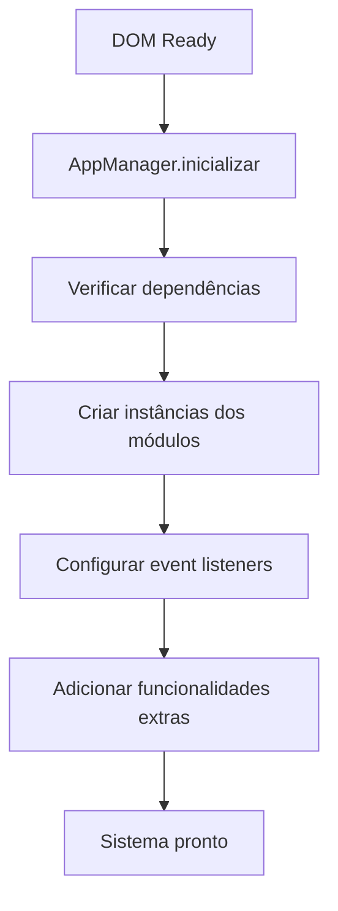

# 📚 Documentação Técnica - Alttab 3D

## 🏗️ Arquitetura do Sistema

### Visão Geral
O sistema foi projetado com arquitetura modular, separando responsabilidades em módulos especializados. Cada módulo é independente e pode ser testado/mantido separadamente.

```
┌─────────────────┐
│   AppManager    │  ← Coordenador principal
└─────────────────┘
         │
    ┌────┴────┐
    │ Módulos │
    └─────────┘
         │
┌────────┼────────┐
│        │        │
▼        ▼        ▼
Calculator  PDF   Config
Interface  Gen   Manager
```

### Fluxo de Dados

1. **Entrada**: Usuário insere dados nos inputs
2. **Validação**: UtilsModule valida dados
3. **Cálculo**: Calculator processa fórmulas
4. **Exibição**: Interface atualiza resultados
5. **PDF**: PDFGenerator cria documento final

## 🔧 Módulos Detalhados

### AppManager (app.js)

**Responsabilidades:**
- Inicialização de todos os módulos
- Gerenciamento de dependências
- Configuração de event listeners globais
- Atalhos de teclado
- Debug e estatísticas

**API Principal:**
```javascript
// Instância global
window.appManager = new AppManager()

// Métodos principais
appManager.inicializar()           // Inicializa sistema
appManager.obterEstatisticas()     // Retorna stats
appManager.debug()                 // Info de debug
appManager.reiniciar()             // Reinicia sistema
```

**Event Listeners:**
- `keydown`: Atalhos (Ctrl+S, Ctrl+Enter, F1)
- `visibilitychange`: Reativação da página
- `submit`: Geração de PDF

### CalculadoraOrcamento3D (calculator.js)

**Responsabilidades:**
- Implementação das fórmulas de cálculo
- Gerenciamento de configurações
- Validação de inputs
- Armazenamento em localStorage

**Fórmulas Implementadas:**
```javascript
// 1. Custo do filamento
custo_filamento = (peso_g / 1000) * preco_filamento_por_kg

// 2. Gasto energético
gasto_energetico_wh = potencia_w * tempo_h * 0.5
gasto_energetico_kwh = gasto_energetico_wh / 1000
custo_energetico = gasto_energetico_kwh * valor_kw_h

// 3. Acessórios
custo_acessorios = quantidade_acessorios * custo_unidade_acessorio

// 4. Custo fixo por unidade
unidades_no_mes = 720 / tempo_h
custo_fixo_por_unidade = custo_fixo_mensal / unidades_no_mes

// 5. Amortização
amortizacao = (valor_maquina / vida_util_horas) * tempo_h

// 6. Subtotal
subtotal = custo_filamento + custo_energetico + custo_acessorios + 
           custo_fixo_por_unidade + amortizacao

// 7. Custo de falha
custo_falha = percentual_falha * (custo_filamento + custo_energetico + amortizacao) * 0.7

// 8. Custo total com novos custos adicionais
custo_total = subtotal + custo_falha
valor_base = custo_total * markup
custo_imposto = valor_base * percentual_imposto
custo_taxa_cartao = valor_base * taxa_cartao  
custo_anuncio = valor_base * custo_anuncio_percentual
valor_final = valor_base + custo_imposto + custo_taxa_cartao + custo_anuncio
```

**API Principal:**
```javascript
// Cálculo principal
calculadora.calcularCusto(tempo_h, peso_g)

// Configurações
calculadora.obterConfiguracoes()
calculadora.atualizarConfiguracao(chave, valor)
calculadora.salvarConfiguracoes()
calculadora.resetarConfiguracoes()

// Import/Export
calculadora.importarConfiguracoes(conteudoTxt)
calculadora.exportarConfiguracoes()
```

### CalculadoraInterface (calculadoraInterface.js)

**Responsabilidades:**
- Interface da calculadora
- Cálculo automático em tempo real
- Exibição de resultados
- Validação visual

**Features:**
- Debounce em inputs (500ms)
- Scroll automático para resultado
- Validação em tempo real
- Feedback visual de erros
- Funcionalidade de copiar resultado

**API Principal:**
```javascript
// Instanciação
const interface = new CalculadoraInterface(calculadora)

// Métodos
interface.calcularCusto()          // Cálculo manual
interface.limparCalculadora()      // Limpa campos
interface.exibirResultado(resultado) // Mostra resultado
interface.copiarResultado()        // Copia para clipboard
```

### ConfiguracaoManager (config.js)

**Responsabilidades:**
- Modal de configurações
- Tabs de navegação
- Import/export de arquivos
- Validação de configurações

**Estrutura do Modal:**
- **Tab Custos**: Filamento, energia, acessórios, fixos
- **Tab Máquina**: Potência, valor, vida útil
- **Tab Import/Export**: Arquivos, reset, preview

**API Principal:**
```javascript
// Instanciação
const configManager = new ConfiguracaoManager(calculadora)

// Métodos
configManager.abrirModal()         // Abre configurações
configManager.salvarConfiguracoes() // Salva mudanças
configManager.importarConfiguracoes() // Importa arquivo
configManager.exportarConfiguracoes() // Exporta arquivo
```

### PDFGenerator (pdfGenerator.js)

**Responsabilidades:**
- Geração estruturada de PDF
- Layout profissional
- Validação de dados
- Inclusão de custos calculados

**Estrutura do PDF:**
1. Cabeçalho com logo
2. Dados do cliente
3. Detalhes do projeto
4. Informações de impressão 3D
5. Detalhamento de custos
6. Preços sugeridos
7. Serviços adicionais
8. Rodapé

**API Principal:**
```javascript
// Instanciação
const pdfGenerator = new PDFGenerator()

// Método principal
pdfGenerator.gerarOrcamento(event)

// Métodos auxiliares
pdfGenerator.coletarDadosFormulario()
pdfGenerator.validarDados(dados)
pdfGenerator.adicionarCabecalho()
// ... outros métodos de seção
```

### UtilsModule (formatting.js)

**Responsabilidades:**
- Formatação de dados
- Validação de campos
- Notificações toast
- Utilitários diversos

**Funções Disponíveis:**
```javascript
// Formatação
UtilsModule.formatarTelefone(event)
UtilsModule.formatarMoeda(valor)
UtilsModule.formatarData(data)
UtilsModule.sanitizarNomeArquivo(nome)

// Validação
UtilsModule.validarCampoObrigatorio(valor, nome)
UtilsModule.validarEmail(email)

// Utilitários
UtilsModule.debounce(func, delay)
UtilsModule.copiarParaClipboard(texto)
UtilsModule.mostrarNotificacao(msg, tipo)
```

## 💾 Armazenamento de Dados

### localStorage

**Chave:** `alttab_config_3d`

**Estrutura:**
```json
{
  "preco_filamento_por_kg": 156.00,
  "potencia_w": 175,
  "valor_kw_h": 0.84,
  "quantidade_acessorios": 1,
  "custo_unidade_acessorio": 0.48,
  "custo_fixo_mensal": 300.00,
  "valor_maquina": 2000.00,
  "vida_util_horas": 24000,
  "percentual_falha": 0.10,
  "markup": 3,
  "percentual_imposto": 0.085,
  "taxa_cartao": 0.045,
  "custo_anuncio_percentual": 0.15
}
```

### Configurações Padrão

Caso não haja dados salvos, o sistema utiliza os valores padrão baseados no CSV fornecido.

## 🎨 Sistema de Estilos

### Variáveis CSS

```css
:root {
    --primary-color: #007bff;
    --secondary-color: #6c757d;
    --success-color: #28a745;
    --danger-color: #dc3545;
    --background-color: #f8f9fa;
    --text-color: #333;
    --border-color: #dee2e6;
    --input-focus: #80bdff;
    --shadow: 0 2px 8px rgba(0,0,0,0.08);
}
```

### Classes Principais

- `.modal`: Sistema de modal
- `.tab-content`: Conteúdo das abas
- `.calculadora-section`: Seção da calculadora
- `.resultado-section`: Área de resultados
- `.form-section`: Seções do formulário
- `.btn-*`: Variações de botões

## 🔄 Fluxo de Inicialização



## 🧪 Testes e Debug

### Console Commands

```javascript
// Verificar estado da aplicação
window.appManager.debug()

// Estatísticas
window.appManager.obterEstatisticas()

// Acessar módulos específicos
window.appManager.calculadora
window.appManager.configManager

// Simular cálculo
window.calculadora3D.calcularCusto(4.56, 14.00)

// Testar notificações
UtilsModule.mostrarNotificacao('Teste', 'success')
```

### Logs Importantes

O sistema gera logs no console para facilitar debug:

- `✅ Sistema carregado com sucesso!`
- `⚠️ Erro no cálculo automático`
- `📦 Inicializando via AppManager`
- `❌ Sistema principal não carregou`

## 🔧 Extensibilidade

### Adicionando Novos Módulos

1. Criar arquivo em `js/modules/`
2. Implementar classe com construtor
3. Exportar via `window.NomeClasse`
4. Adicionar em `AppManager.verificarDependencias()`
5. Instanciar em `AppManager.inicializar()`

### Adicionando Novas Configurações

1. Adicionar em `configuracoes` padrão do Calculator
2. Adicionar campo no modal (config.js)
3. Incluir na validação
4. Atualizar documentação

### Personalizando PDF

Modifique métodos em `PDFGenerator`:
- `adicionarCabecalho()`: Logo e título
- `adicionarDadosCliente()`: Seção do cliente
- `adicionarDetalhamentoCusto()`: Layout dos custos

## 📱 Responsividade

### Breakpoints

- **Desktop**: > 768px
- **Tablet**: 768px - 600px
- **Mobile**: < 600px

### Adaptações Mobile

- Modal full-screen
- Tabs verticais
- Botão configurações fixo vira relativo
- Grid de resultados em coluna única

## 🚀 Performance

### Otimizações Implementadas

- **Debounce**: Cálculo automático otimizado
- **Lazy Loading**: Módulos carregados sob demanda
- **LocalStorage**: Cache de configurações
- **Event Delegation**: Listeners otimizados
- **CSS Variables**: Estilos reutilizáveis

### Métricas Esperadas

- **First Paint**: < 1s
- **Interactive**: < 2s
- **Bundle Size**: ~50KB (sem jsPDF)
- **Memory Usage**: < 10MB

---

**Documentação atualizada em**: Setembro 2025  
**Versão do sistema**: 1.0.0
